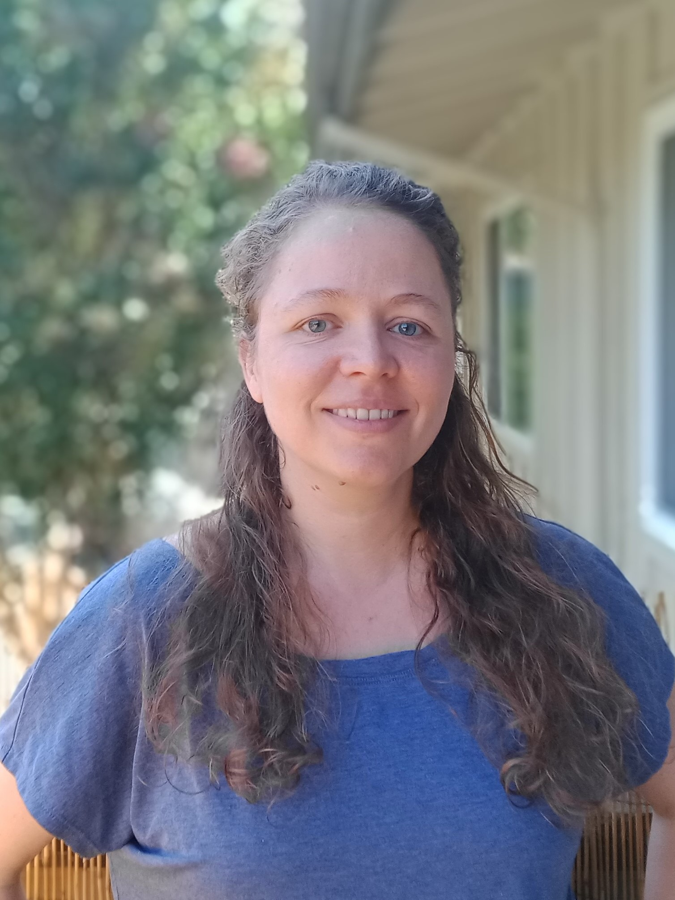

<style>
body {
text-align: justify}
</style>


:::: {style="display: flex;"}

::: {style="width:30%;margin-top:70px;"}

<br>

{width=400px}
:::

::: {width:"10%";}

:::

::: {style="width:40%; margin-left:50px;"}

<br>

## Welcome!

<br>
I am a PhD candidate in political science at New York University.

<br>
My research interests center on gender and political participation, with a regional focus on India. My dissertation investigates under which conditions women turn out to vote at equal rates to men, and seeks to explain regional and temporal variation in the closing of the gender turnout gap. 

<br>
I employ a variety of methodological approaches in my research, including surveys, experiments, statistical analysis of large datasets, and qualitative interviews. My dissertation combines several months of qualitative fieldwork with an original household-level survey, full village censuses and a newly assembled administrative dataset on turnout by gender to understand which factors affect women's participation rates relative to men's.

<br>
You can contact me at franziska 'at' nyu 'dot' edu. My CV is available 
```{r,echo=F,message=F,warning=F}
xfun::pkg_load2(c("htmltools", "mime"))
xfun::embed_file('downloads/FranziskaRoscherCV.pdf', text ="here.")
```
:::

::::    


